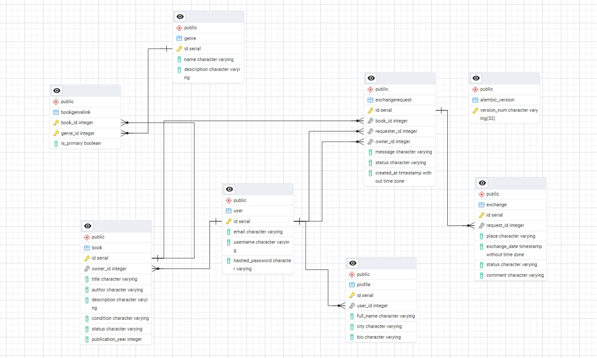

## Текущее состояние
На текущем этапе выполнены:
- практическая работа 1.1  базовое FastAPI-приложение с временными данными;
- практическая работа 1.2  перенос приложения на PostgreSQL и SQLModel, реализация таблиц и связей;
- практическая работа 1.3  настройка Alembic и миграций базы данных.

На следующих этапах планируется:
- расширение модели данных сущностями обмена книгами;
- реализация авторизации и JWT;
- завершение лабораторной работы до максимального балла.

# Лабораторная работа 1

## Тема
Реализация серверного приложения FastAPI по теме буккроссинга.

## Цель работы
Разработать серверное приложение на FastAPI с использованием PostgreSQL, SQLModel, Alembic и механизмов аутентификации, реализующее предметную область сервиса для обмена книгами между пользователями.

## Выбранная тема
Разработка веб-приложения для буккроссинга.

Приложение позволяет пользователям:
- регистрироваться и входить в систему;
- создавать и редактировать профиль;
- добавлять книги для обмена;
- просматривать общий список книг;
- отправлять запросы на обмен книгами;
- принимать или отклонять запросы;
- фиксировать и завершать обмены;
- просматривать свои книги, запросы и обмены.

## Выполненные практические работы

### Практическая работа 1.1
На первом этапе было создано базовое приложение FastAPI с временными данными.

Были реализованы:
- маршруты для книг;
- маршруты для профилей;
- маршруты для жанров;
- базовая работа со Swagger.

### Практическая работа 1.2
На втором этапе приложение было переведено на PostgreSQL и SQLModel.

Были реализованы таблицы:
- `user`
- `profile`
- `book`
- `genre`
- `bookgenrelink`

Были настроены связи:
- `User -> Book`
- `User -> Profile`
- `Book <-> Genre` через `BookGenreLink`

Для ассоциативной сущности `BookGenreLink` использовано дополнительное поле `is_primary`.

### Практическая работа 1.3
На третьем этапе была подключена система миграций Alembic.

Были выполнены:
- инициализация Alembic;
- настройка `alembic.ini`;
- настройка `migrations/env.py`;
- создание и применение миграций;
- перевод проекта на управление схемой базы данных через Alembic.

## Доработка модели данных в лабораторной работе
После выполнения практических работ модель данных была расширена в соответствии с логикой предметной области буккроссинга.

Дополнительно были добавлены сущности:
- `ExchangeRequest` — запрос на обмен книгой;
- `Exchange` — факт обмена книгой.

Таким образом, итоговая модель включает:
- `User`
- `Profile`
- `Book`
- `Genre`
- `BookGenreLink`
- `ExchangeRequest`
- `Exchange`

## Реализованные возможности backend
В приложении реализованы:

### Пользователи и аутентификация
- регистрация;
- вход в систему;
- генерация JWT-токена;
- получение текущего пользователя;
- смена пароля;
- хэширование паролей.

### Работа с книгами
- просмотр всех книг;
- просмотр доступных книг;
- добавление книги;
- редактирование книги;
- удаление книги;
- просмотр собственных книг пользователя;
- запрос книги для обмена.

### Работа с жанрами
- создание жанров;
- просмотр жанров;
- привязка жанров к книгам;
- получение жанров конкретной книги.

### Работа с запросами на обмен
- создание запроса на обмен;
- просмотр входящих запросов;
- просмотр исходящих запросов;
- принятие запроса;
- отклонение запроса.

### Работа с обменами
- создание обмена по принятому запросу;
- просмотр обменов пользователя;
- завершение обмена.

## Логика предметной области
В рамках выбранной модели после завершения обмена книга помечается статусом `exchanged` и исключается из списка доступных книг.

Если пользователь захочет снова выставить такую книгу на обмен, он создаёт новую запись о книге в системе.

## Реализованный frontend
Дополнительно был реализован пользовательский интерфейс на HTML, CSS и JavaScript.

Фронтенд включает страницы:
- входа;
- регистрации;
- общеий список книг;
- добавление книги;
- список собственных книг;
- входящие и исходящие запросы;
- списк обменов.

Через интерфейс пользователь может:
- зарегистрироваться и войти;
- просматривать книги;
- запросить книгу;
- принимать и отклонять запросы;
- завершать обмены.

## Использованные технологии
- Python
- FastAPI
- PostgreSQL
- SQLModel
- SQLAlchemy
- Alembic
- JWT
- HTML
- CSS
- JavaScript

## Вывод
В результате лабораторной работы было реализовано полноценное серверное приложение по теме буккроссинга.

Проект включает:
- модель данных;
- CRUD-операции;
- связи one-to-many и many-to-many;
- ассоциативную сущность с дополнительным полем;
- систему миграций;
- регистрацию и аутентификацию по JWT;
- пользовательский интерфейс для основных сценариев работы.

Разработанное приложение соответствует тематике лабораторной работы и покрывает основной функционал сервиса для обмена книгами между пользователями.