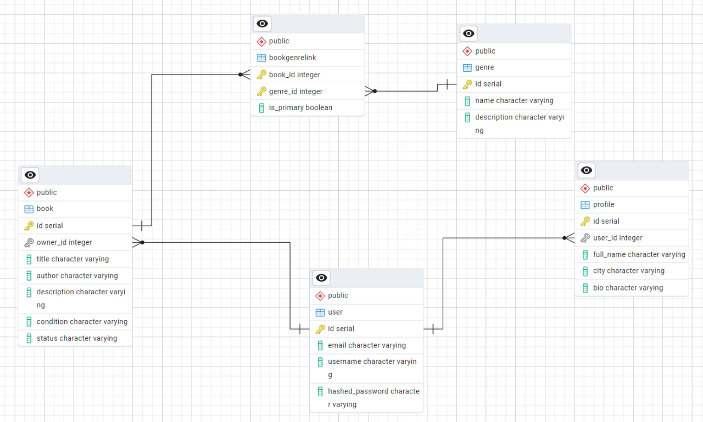

# Практическая работа 1.2

## Тема
Использование PostgreSQL и SQLModel в серверном приложении FastAPI по теме буккроссинга.

## Цель работы
Научиться подключать PostgreSQL к приложению FastAPI, описывать таблицы через SQLModel, реализовывать связи между сущностями и выполнять CRUD-операции через ORM.

## Что было сделано
В рамках практической работы приложение было переведено с временного хранения данных на PostgreSQL.

Были реализованы следующие таблицы:
- `user`
- `profile`
- `book`
- `genre`
- `bookgenrelink`

Также были настроены связи между сущностями:
- один пользователь может иметь несколько книг;
- один пользователь связан с профилем;
- книга может иметь несколько жанров;
- один жанр может относиться к нескольким книгам.

Для связи many-to-many между книгами и жанрами используется ассоциативная таблица `bookgenrelink`, содержащая дополнительное поле `is_primary`.

## Реализованный функционал

### Users
- `GET /users/`
- `GET /users/{user_id}`
- `POST /users/`
- `PATCH /users/{user_id}`
- `DELETE /users/{user_id}`

### Books
- `GET /books/`
- `GET /books/{book_id}`
- `POST /books/`
- `PATCH /books/{book_id}`
- `DELETE /books/{book_id}`
- `GET /books/{book_id}/genres`

### Genres
- `GET /genres/`
- `GET /genres/{genre_id}`
- `POST /genres/`
- `PATCH /genres/{genre_id}`
- `DELETE /genres/{genre_id}`

### Profiles
- `GET /profiles/`
- `GET /profiles/{profile_id}`
- `POST /profiles/`
- `PATCH /profiles/{profile_id}`
- `DELETE /profiles/{profile_id}`

### BookGenres
- `GET /book-genres/`
- `POST /book-genres/`

## Использованные технологии
- Python
- FastAPI
- PostgreSQL
- SQLModel
- Uvicorn

## Структура базы данных
На текущем этапе реализована базовая структура базы данных, минимально нужная для практики 1.2:
- пользователи;
- профили;
- книги;
- жанры;
- связь между книгами и жанрами.

Данная структура позволяет продемонстрировать работу с PostgreSQL, ORM SQLModel, CRUD-операциями, а также связи one-to-many и many-to-many.

В дальнейшем в рамках лабораторной работы модель будет расширена сущностями, связанными с обменом книгами.

## Схема базы данных
Ниже приведён скриншот ER-диаграммы базы данных, построенной в pgAdmin.

## Результат
В результате практической работы приложение было успешно переведено на PostgreSQL, а модели и CRUD-операции были реализованы через SQLModel. 
Полученная структура базы данных будет расширена на следующих этапах лабораторной работы.